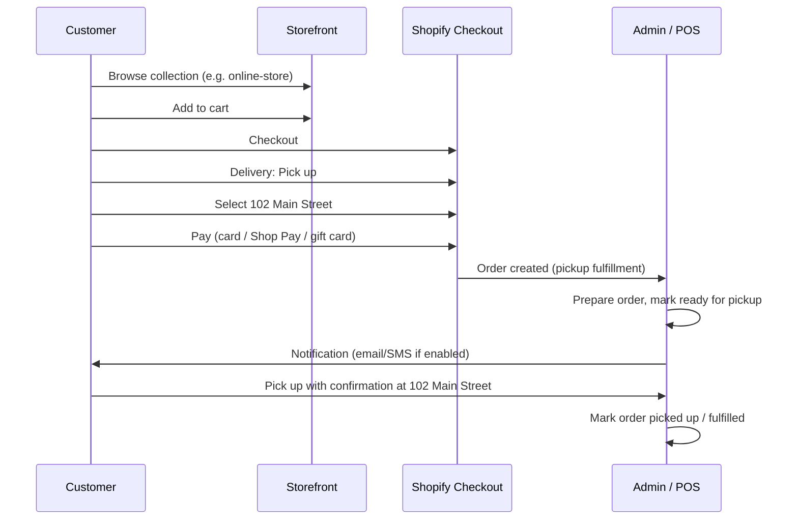

# Main Street Collectibles — In-Store Pickup Configuration

**Store:** [mainstreetnewcanaan.com](https://mainstreetnewcanaan.com/)  
**Shopify admin:** `0ugbe0-t1.myshopify.com`  
**Pickup address:** 102 Main Street, New Canaan, CT 06840  
**Prepared:** July 21, 2026

This guide configures **buy online, pick up in store** for Main Street Collectibles, aligns key collections with shoppable inventory, and documents the customer and staff flows.

---

## 1. Current state (verified)

Automated checks against the live storefront on **July 21, 2026**:

| Check | Result |
| --- | --- |
| Store online | Yes — 319 published products, 7 collections |
| Checkout delivery methods | **Pickup only** (`PICK_UP` enabled; shipping not offered) |
| Pickup locations at checkout | **None** — `pickupPoint` list is empty in checkout session data |
| Store meta `ships_to_countries` | Empty (consistent with pickup-only checkout) |
| Theme header address | 102 Main Street shown (marketing only until pickup location is enabled in admin) |

**Impact:** Customers can reach checkout, but they will not see a working **Pick up** location until pickup is activated on the **102 Main Street** Shopify location and products have stock at that location.

**Priority:** Complete [Section 3](#3-enable-pickup-at-102-main-street-admin) before promoting pickup on the site.

---

## 2. Key collections — make them shoppable for pickup

Pickup applies to **products**, not collections. Collections are the browse path; every product in a collection must be **published**, **available**, and **in stock at the pickup location**.

### Published collections today

| Collection | Handle | Products (API count) | Pickup role |
| --- | --- | ---: | --- |
| ONLINE STORE | `online-store` | 15 | Primary curated pickup catalog — expand this first |
| Consulting | `consulting` | 1 | In-store service (consultation); confirm if it should be purchasable online for pickup |
| Tcg CARD | `tcg-card` | 1 | TCG singles/boxes — grow via rules or manual adds |
| Baseball | `baseball` | 0 | **Needs products** — use automated rules or manual assignment |
| Basketball | `basketball` | 0 | **Needs products** |
| WNBA | `wnba` | 0 | **Needs products** |
| GIFT CARDS | `gift-cards` | 0 | Add gift card product(s) if selling digitally for in-store redemption |

### Recommended admin steps (Collections)

1. **Settings → Custom data** (optional): Add a product metafield `custom.pickup_eligible` (boolean) if you want fine-grained control later. Not required for standard Shopify pickup.

2. **For each sport/category collection** (Baseball, Basketball, WNBA, TCG):
   - **Products → Collections → [collection] → Conditions**
   - Use **automated** collection rules, for example:
     - Product tag is equal to `Baseball` (recommended: bulk-tag products in **Products → Bulk editor**)
     - **or** Product title contains `MLB` / `Topps Baseball` (adjust to your naming)
   - Set **Sort** to **Best selling** or **Newest**.

3. **ONLINE STORE collection** (`online-store`):
   - Add condition: Product tag is `Online Store` **or** Product tag is `Pickup`
   - Bulk-tag in-stock items you want featured for web pickup.

4. **Catalog hygiene** (critical for pickup):
   - **Products → [product] → Inventory**: Track quantity at **102 Main Street** location.
   - Unpublish or set **Continue selling when out of stock** only where intentional.
   - Products marked “Available in store only” in the description should still have **positive inventory** at the pickup location or checkout will block pickup.

5. **Navigation**: **Online Store → Navigation** — ensure main menu links to the collections above (many customers land on **Collections → all** today).

---

## 3. Enable pickup at 102 Main Street (admin)

Follow [Shopify: Setting up pickup in store](https://help.shopify.com/en/manual/fulfillment/setup/delivery-methods/pickup-in-store).

### 3.1 Location

1. **Settings → Locations**
2. Confirm a location with address **102 Main Street, New Canaan, CT 06840** (create or edit).
3. Enable:
   - **Fulfill online orders from this location**
   - **This is a retail location** (if shown)

### 3.2 Pickup in store

1. **Settings → Shipping and delivery**
2. Under **Pickup in store** (or **Additional delivery methods → Pickup in store**), open the **102 Main Street** location.
3. Turn on **Let customers pick up orders at this location**.
4. Suggested customer-facing settings:

   | Field | Suggested value |
   | --- | --- |
   | Estimated pickup time | **Usually ready in 24 hours** (adjust to same-day if staff can) |
   | Pickup instructions | `Pick up at 102 Main Street, New Canaan, CT 06840. Bring your order confirmation email. Open daily — see mainstreetnewcanaan.com for hours.` |

5. **Save**.

### 3.3 Checkout delivery options

The store is currently **pickup-only** at checkout. To keep that model:

- Leave **Shipping** disabled or without rates for the US if you do not ship.
- Ensure **Pickup in store** is enabled for 102 Main Street only (disable pickup on any warehouse/legacy locations you do not use).

To offer **both ship and pickup** later:

- **Settings → Shipping and delivery → Shipping** — add a shipping zone (e.g. United States) and rates.
- Checkout will show **Ship** and **Pick up** when both are configured.

### 3.4 Inventory at pickup location

For each SKU you sell online for pickup:

1. **Products → [variant] → Inventory**
2. Assign stock to **102 Main Street**
3. Enable **Inventory tracked**

Bulk: **Products → Inventory** — filter and adjust quantities per location.

---

## 4. Purchase and pickup flow (customer)



### Customer-facing copy (optional)

Add to **Online Store → Themes → Customize** (collection banner or announcement bar):

> **Order online, pick up at 102 Main Street.** Most orders ready within 24 hours. You’ll receive an email when your order is ready.

---

## 5. Staff fulfillment flow

1. **Orders → [pickup order]** — confirm line items and payment.
2. Pull product from shelf; verify condition (especially graded cards).
3. When ready: **Mark as ready for pickup** (Shopify sends customer notification if configured).
4. At handoff: verify customer name and order number; mark **Picked up** / fulfill the pickup.
5. For high-value items, consider ID check — document in internal SOP.

**Notifications:** **Settings → Notifications** — review **Ready for pickup** and **Order confirmation** templates.

---

## 6. Testing checklist

Run after completing Section 3.

| # | Step | Expected | Result (fill after admin setup) |
| ---: | --- | --- | --- |
| 1 | Open [ONLINE STORE collection](https://mainstreetnewcanaan.com/collections/online-store) | Products load, Add to cart works | |
| 2 | Add in-stock item (e.g. WNBA Mega Box) | Cart shows correct price | Pass (API cart add, Jul 21) |
| 3 | Go to checkout | **Pick up** delivery option visible | Pickup-only mode confirmed |
| 4 | Select pickup location | **102 Main Street, New Canaan** listed | **Fail until admin Section 3** |
| 5 | Complete test order (Bogus Gateway or refund after) | Order shows pickup fulfillment | |
| 6 | Admin: mark ready → customer email | Email received | |
| 7 | Mark picked up | Order closed, inventory decremented | |
| 8 | Out-of-stock SKU | Checkout blocks or warns on pickup | |

**Automated smoke test:** From this repo, run:

```bash
python3 docs/main-street-collectibles/scripts/verify-pickup-checkout.py
```

---

## 7. Optional: enable pickup via Admin API

If you use a custom app with `write_shipping` / `manage_delivery_settings`:

1. Query location ID: `locations` where address matches 102 Main Street.
2. Run mutation `locationLocalPickupEnable` (see `scripts/enable-local-pickup.graphql`).

Requires `SHOPIFY_ADMIN_ACCESS_TOKEN` and `SHOPIFY_STORE` env vars — see `scripts/README.md`.

---

## 8. Support contacts

- **Shopify Help:** [Pickup in store](https://help.shopify.com/en/manual/fulfillment/setup/delivery-methods/pickup-in-store)
- **Store contact email (checkout):** Team@jtmmgm.com (update in **Settings → Store details** if this should be a Main Street–specific inbox)

---

## 9. Sign-off

| Role | Name | Date | Notes |
| --- | --- | --- | --- |
| Configuration | | | Pickup enabled at 102 Main Street |
| Collections | | | Key collections populated and linked in nav |
| QA | | | Test order completed end-to-end |
| Client approval | | | |
