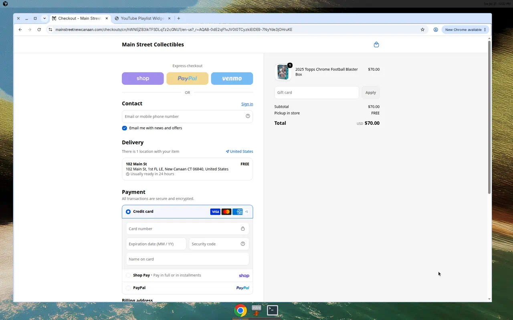
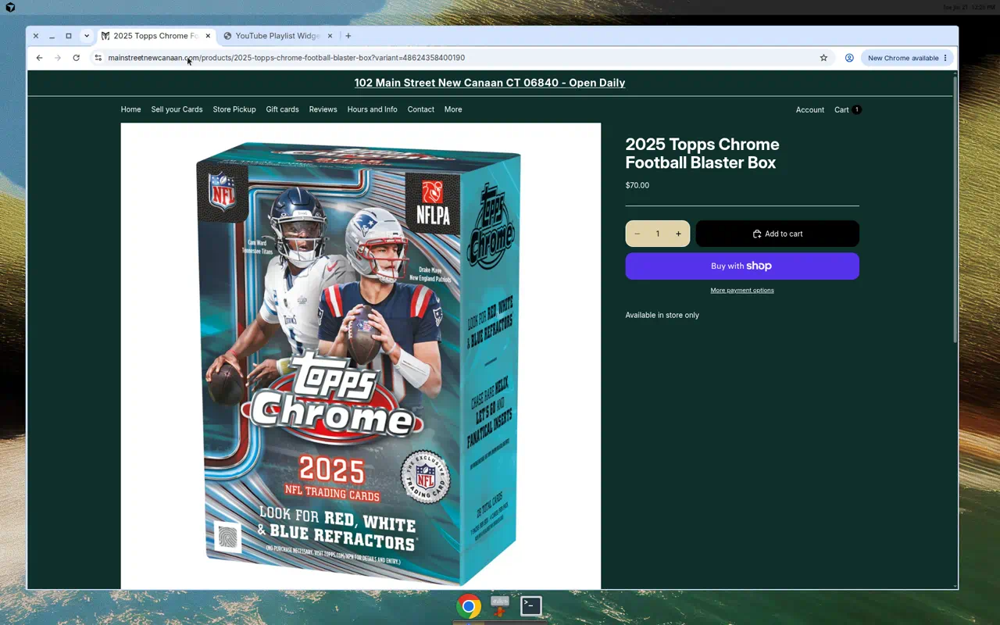
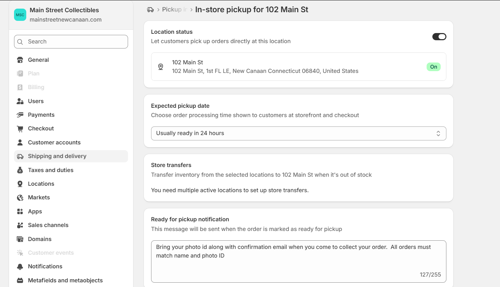
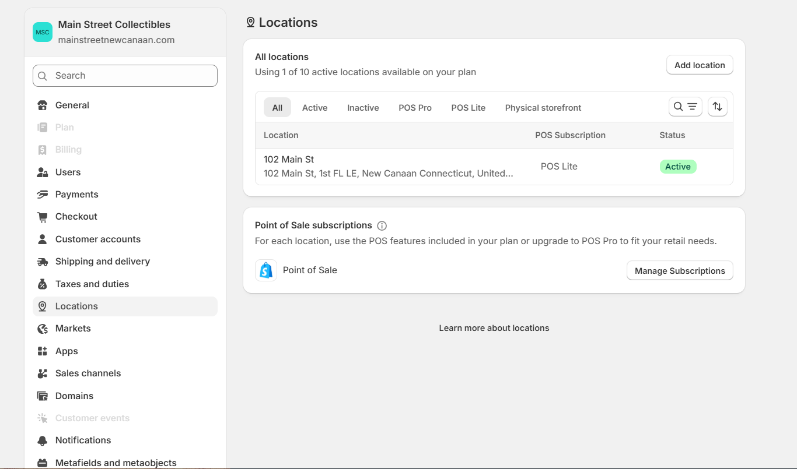
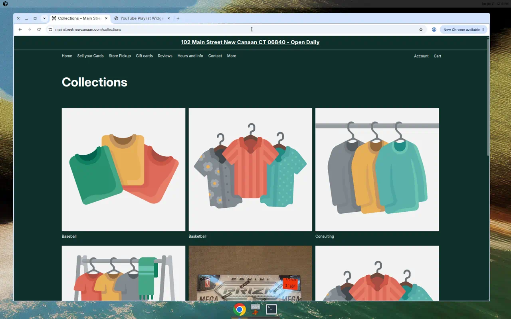
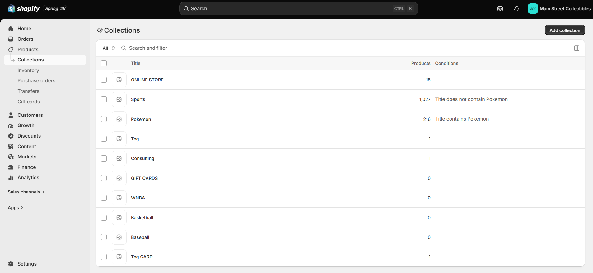
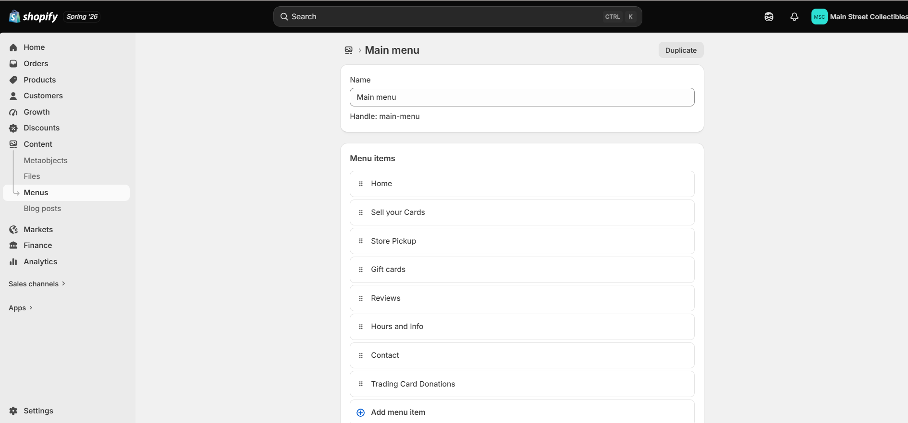
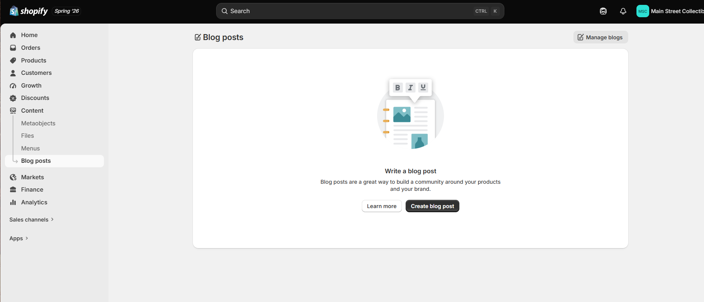
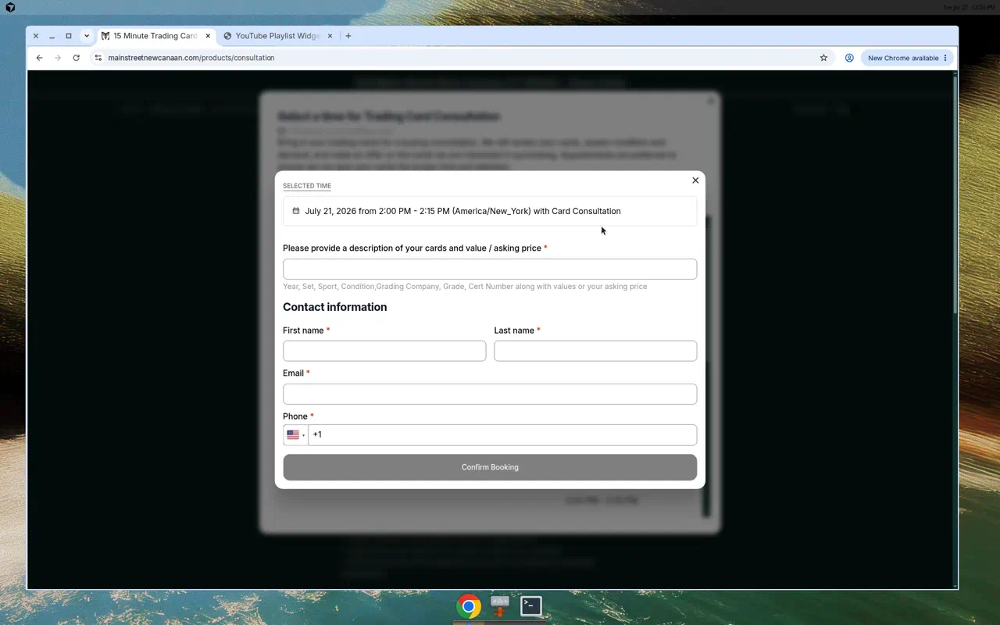
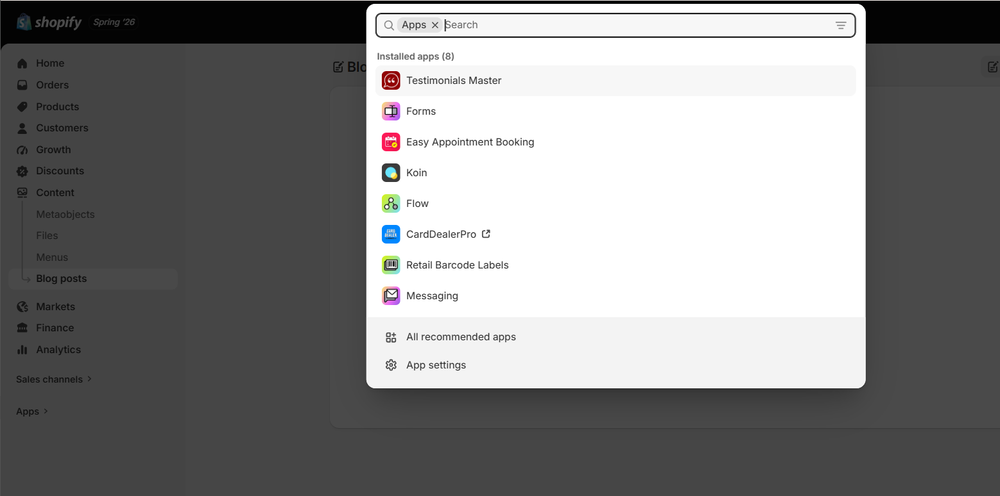

# Developer Audit — Main Street Collectibles

Store: https://mainstreetnewcanaan.com/  ·  Location: 102 Main Street, New Canaan CT 06840

---

## 1. In-Store Pickup Configuration

### Current state

- Local pickup is ALREADY live at checkout: shows "102 Main St, 1st FL LE, New Canaan CT 06840", "Usually ready in 24 hours", FREE. Tested products are pickup-only (no shipping option shown).
- Product pages do NOT use Shopify's native "Pickup availability" widget — only plain text "Available in store only".
- "Store Pickup" nav link points to the "ONLINE STORE" collection (15 products); other collections not verified for pickup / inventory-location assignment.

### Backend (admin) findings

- Shipping & delivery -> Pickup (102 Main St): Location status is ON, expected pickup date is set to "Usually ready in 24 hours", and a custom ready-for-pickup message is configured ("Bring your photo id along with confirmation email... All orders must match name and photo ID"). Store transfers are unavailable because only one location exists.
- Locations: using 1 of 10 active locations - 102 Main St (POS Lite, Active). Pickup is correctly tied to this single storefront location; the remaining work is making sure key collections/products are stocked and assigned here and surfacing pickup earlier on product pages.

### Work remaining

- Verify pickup + inventory location assigned across all key collections; make each shoppable.
- Enable native pickup-availability block on product pages (earlier visibility of pickup + ready time).
- Confirm pickup prep-time and "ready for pickup" notification email.
- End-to-end checkout test per key collection; client documentation.

---

## 2. Store Cleanup

### Current state

- Theme is clean but homepage is very sparse — logo + email signup only; no hero, featured products, or collections grid.
- Navigation labeling is confusing ("Store Pickup" → "ONLINE STORE"); no "Shop All" discovery path.
- Footer is minimal — no phone/email, hours not repeated, no shipping/FAQ links.

### Backend (admin) findings

- Collections: admin has 10 collections but the two with real inventory - Sports (1,027 products) and Pokemon (216) - are NOT shown on the site, while several empty ones (GIFT CARDS, WNBA, Basketball, Baseball = 0 products) ARE shown. Frontend shows only: Baseball, Basketball, Consulting, GIFT CARDS, Tcg CARD, ONLINE STORE (15). Recommend hiding/merging the empty collections and surfacing Sports/Pokemon so shoppers can actually browse stock.
- Main menu: Home, Sell your Cards, Store Pickup, Gift cards, Reviews, Hours and Info, Contact, Trading Card Donations. There is no clear "Shop / All products" entry and "Store Pickup" points to the ONLINE STORE collection - relabel and add a proper shopping path.
- Content -> Blog posts is empty (no posts). Optional: publish a few posts for SEO/community, or remove any blog links so the storefront stays tidy.

### Work remaining

- Build out homepage (hero, featured collections/products, CTAs).
- Hide/merge empty collections (Baseball, Basketball, WNBA, GIFT CARDS) and surface stocked ones (Sports, Pokemon); add collection images + descriptions.
- Restructure/relabel nav + add shop discovery.
- Complete footer (contact, hours, policy/FAQ links).
- Review core settings/config (checkout, notifications, SEO/meta, favicon, policies) and QA broken elements cross-device.

---

## 3. Buying Intake Form

### Current state

- A structured selling intake ALREADY exists inside the "15 Minute Trading Card Consultation" (Easy Appointment Booking): required field "Please provide a description of your cards and value / asking price" (guides Year, Set, Sport, Condition, Grading Company, Grade, Cert Number, price) + First/Last name, Email, Phone, and date/time picker.
- Separate generic Contact form (Name, Email, Phone, Comment) — not an intake form.

### Backend (admin) findings

- 8 apps installed: Testimonials Master, Forms, Easy Appointment Booking, Koin, Flow, CardDealerPro, Retail Barcode Labels, Messaging.
- The intake form can be built with the already-installed Forms + Easy Appointment Booking apps (no new app needed); CardDealerPro (card buying/inventory) and Flow (automation) can route submissions into the existing buying workflow.

### Work remaining (align to buying workflow + better structure)

- Confirm requirements/workflow with client.
- Convert the single free-text field into structured inputs (sport dropdown, grading company, grade, cert #, quantity, condition, optional card-image upload) via Easy Appointment Booking custom questions / Forms.
- Ensure details are captured pre-appointment and land somewhere usable (order notes / metafields / email / CardDealerPro / Flow) — schema + validation.
- Test end-to-end (incl. edge cases) + client review.

---
