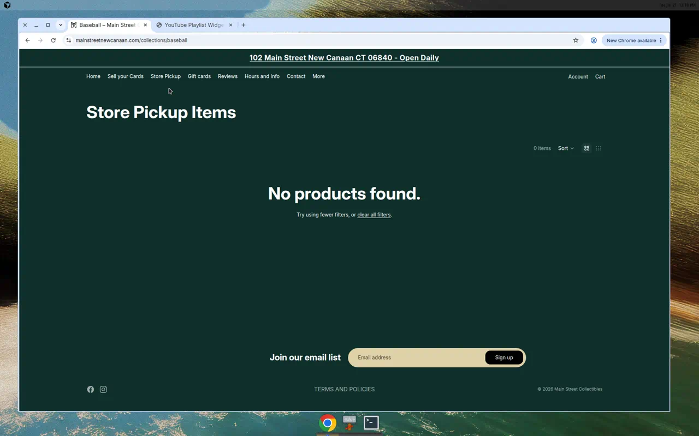
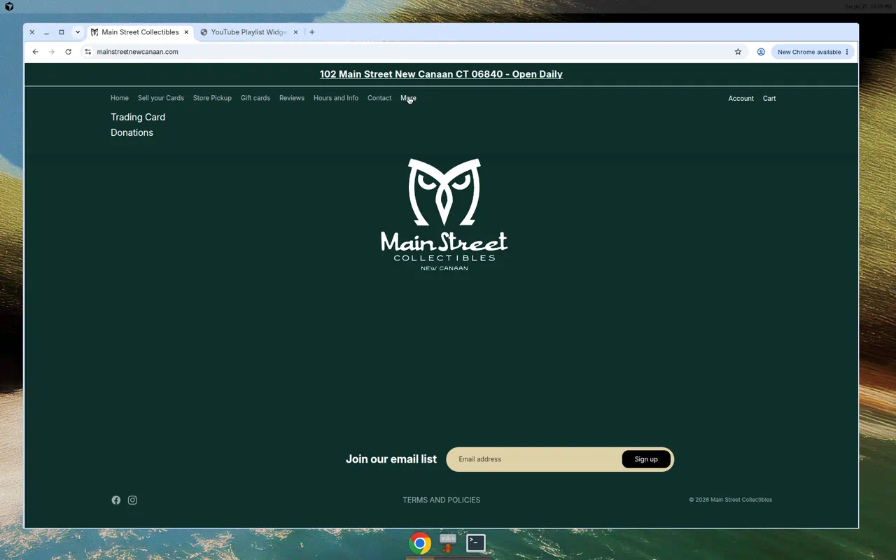
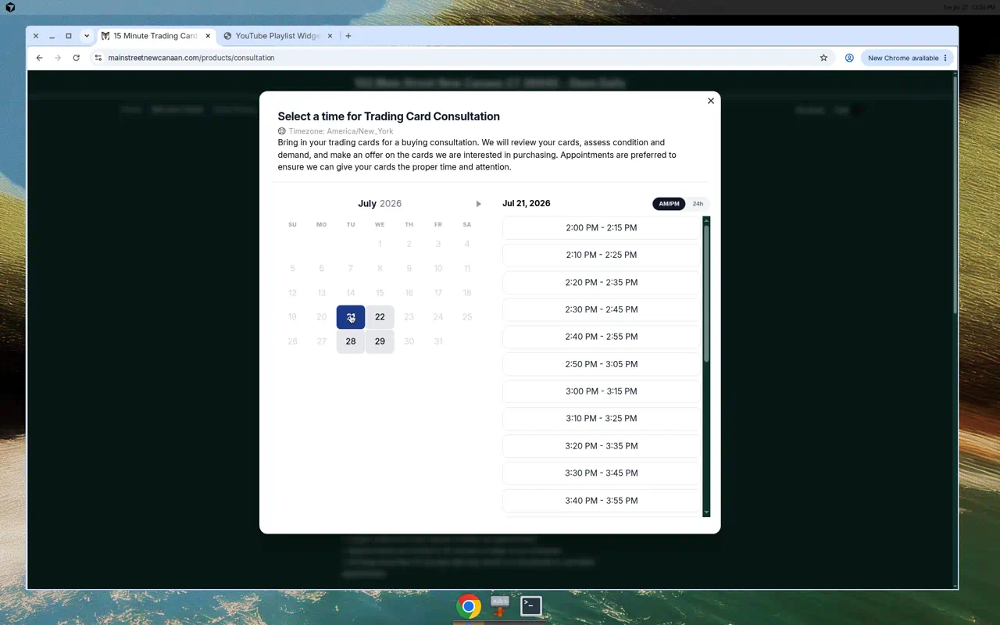

# Developer Audit — Main Street Collectibles

Store: https://mainstreetnewcanaan.com/ · Scope: frontend-only audit (no admin login) · Location: 102 Main Street, New Canaan CT 06840

---

## 1. In-Store Pickup Configuration

Current state
- Local pickup is ALREADY live at checkout: shows "102 Main St, 1st FL LE, New Canaan CT 06840", "Usually ready in 24 hours", FREE. Tested products are pickup-only (no shipping option shown).
- Product pages do NOT use Shopify's native "Pickup availability" widget — only plain text "Available in store only".
- "Store Pickup" nav link points to the "ONLINE STORE" collection (15 products); other collections not verified for pickup/inventory-location assignment.

Work remaining
- Verify pickup + inventory location assigned across all key collections; make each shoppable.
- Enable native pickup-availability block on product pages (earlier visibility of pickup + ready time).
- Confirm pickup prep-time + "ready for pickup" notification email.
- End-to-end checkout test per key collection; client documentation.

Estimate: 5–8 hrs

---

## 2. Store Cleanup

Current state
- Theme is clean but homepage is very sparse — logo + email signup only; no hero, featured products, or collections grid.
- 6 of 7 collections use default Shopify placeholder images; "Baseball" collection is empty (0 products).
- Navigation labeling is confusing ("Store Pickup" → "ONLINE STORE"); no "Shop All" discovery path.
- Footer is minimal — no phone/email, hours not repeated, no shipping/FAQ links.

Work remaining
- Build out homepage (hero, featured collections/products, CTAs).
- Replace 6 placeholder collection images + add collection descriptions.
- Populate or hide empty "Baseball" collection.
- Restructure/relabel nav + add shop discovery.
- Complete footer (contact, hours, policy/FAQ links).
- Review core settings/config (checkout, notifications, SEO/meta, favicon, policies) and QA broken elements cross-device.

Estimate: 9–14 hrs

---

## 3. Buying Intake Form

Current state
- A structured selling intake ALREADY exists inside the "15 Minute Trading Card Consultation" (Easy Appointment Booking): required field "Please provide a description of your cards and value / asking price" (guides Year, Set, Sport, Condition, Grading Company, Grade, Cert Number, price) + First/Last name, Email, Phone, and date/time picker.
- Separate generic Contact form (Name, Email, Phone, Comment) — not an intake form.

Work remaining (align to buying workflow + better structure)
- Confirm requirements/workflow with client.
- Convert the single free-text field into structured inputs (sport dropdown, grading company, grade, cert #, quantity, condition, optional card-image upload) via Easy Appointment Booking custom questions.
- Ensure details are captured pre-appointment and land somewhere usable (order notes/metafields/email/export) — schema + validation.
- Test end-to-end (incl. edge cases) + client review.

Estimate: 8–12 hrs

---

## Totals & Notes

| Subtask | Estimate |
| --- | --- |
| In-Store Pickup Configuration | 5–8 hrs |
| Store Cleanup | 9–14 hrs |
| Buying Intake Form | 8–12 hrs |
| **Full scope** | **22–34 hrs** |

Notes
- Estimates are development effort hours, grounded in the findings above.
- Audit is frontend-only; a few settings (inventory-location assignment, checkout/notification config, app data mapping) need admin access to confirm and may shift estimates.
- Next step after completion: share these findings with the team.
